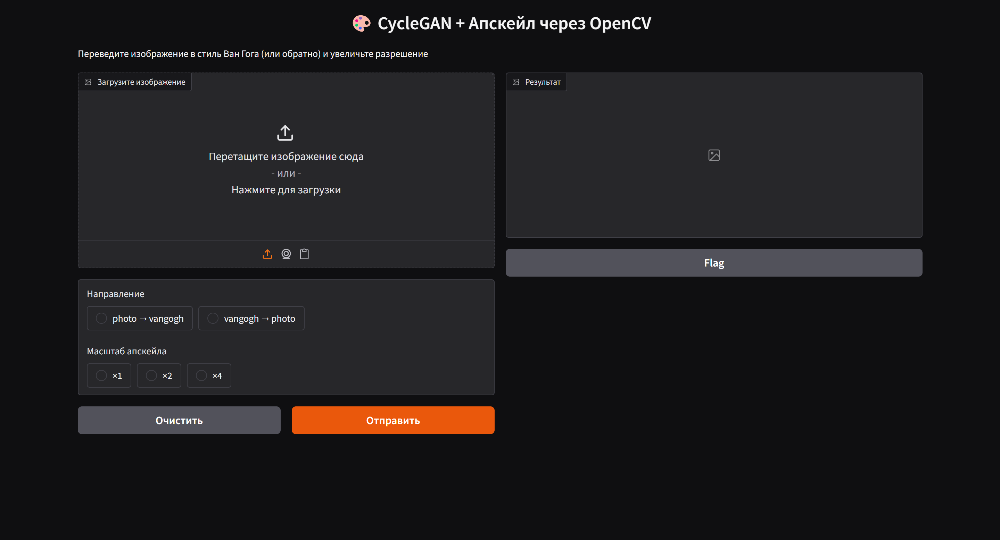
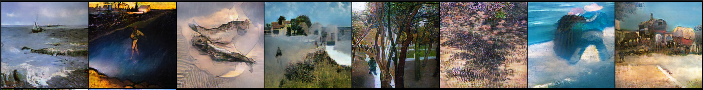
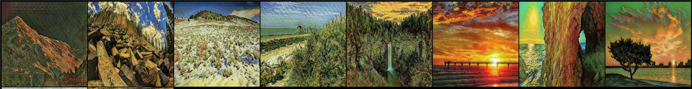
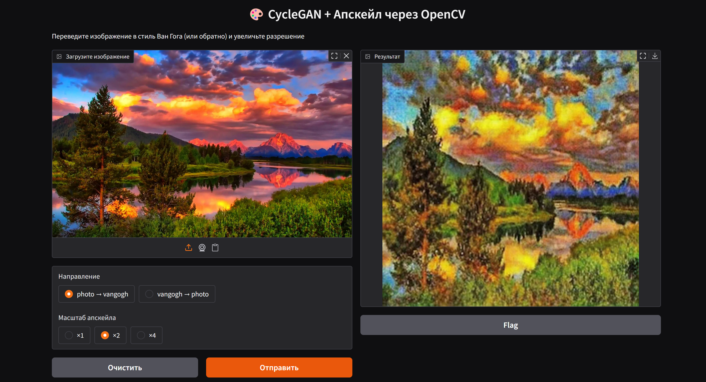

# 🎨 CycleGAN + OpenCV Upscale

Этот проект реализует CycleGAN для перевода изображений между двумя стилями (например, фотография ↔ стиль Ван Гога) с возможностью увеличения разрешения результата через OpenCV.

---

## 🚀 Возможности

- ✅ Перевод изображений между стилями (`photo ↔ vangogh`);
- ✅ Увеличение разрешения результата (апскейл) ×1, ×2, ×4;
- ✅ Веб-интерфейс на Gradio;
- ✅ Быстрый запуск без зависимостей от тяжёлых моделей апскейлинга.

---

## 🖼️ Интерфейс



---

## 📦 Установка

```terminal
git clone https://github.com/noesskeetit/CycleGAN.git
cd CycleGAN

# Установить зависимости
pip install -r requirements.txt
```
---
## ▶️ Запуск
#### !Перед запуском необходимо скачать веса модели (4 штуки) с гугл диска и положить их в корень проекта!
#### Ссылка на веса модели: 
```link
https://drive.google.com/drive/folders/1o0mK5s-_1Sgbn6SavboT0az7ROMpzYPS?usp=sharing
```
### Далее в терминале:
### 1) Необходимо зайти в корень проекта
### 2) Запустить проект через:
```python
python interface.py
```
После запуска Gradio откроет веб-интерфейс в браузере:
загрузите изображение, выберите направление и масштаб апскейла.
---
## 📁 Структура проекта
```
CycleGAN/
├── interface.py              # Gradio-интерфейс
├── generator_model.py        # Generator
├── discriminator_model.py    # Discriminator
├── config.py                 # Настройки и трансформации
├── README.md
├── train_model.ipynb         # Ноутбук с обучением и валидацией
├── requirements.txt
```
---
## 🧪 Результаты

IC (метрика) расположился в районе 5-6 что говорит о довольно хорошем качестве получившейся модели.

По FID будет мерить несправедливо, так как она работает для случаев когда GAN обучается для пар картинок, у меня немного другой случай)

При визуальной оценке получившихся изображений, на мой взгляд, тоже получилось довольно неплохо.
Да, есть местами картинки которые прям фигня, но подавляющее большинство можно подумать что реально рисовал Ван Гог))

В целом работа получилась довольно интересная, я понял как работает CycleGAN, а также познакомился с метриками IC & FID.
Раньше с изображениями не работал, как первый опыт считаю очень круто, нормально погрузился в работу сверток.

P.S. Сначала пробовал обучать без identity loss - получалось все довольно плохо,
потом решил все таки его добавить и качество поднялось до приемлемого уровня.

Моделька училась 15 часов на 150 эпохах. Уже где-то со второй эпохи модель начинает генерировать что-то нормальное,
но вот прям удовлетворяющего уровня удалось добиться при раздувании эпох до 150.
___
### Примеры с трейна



___
### Пример работы с интерфейсом

